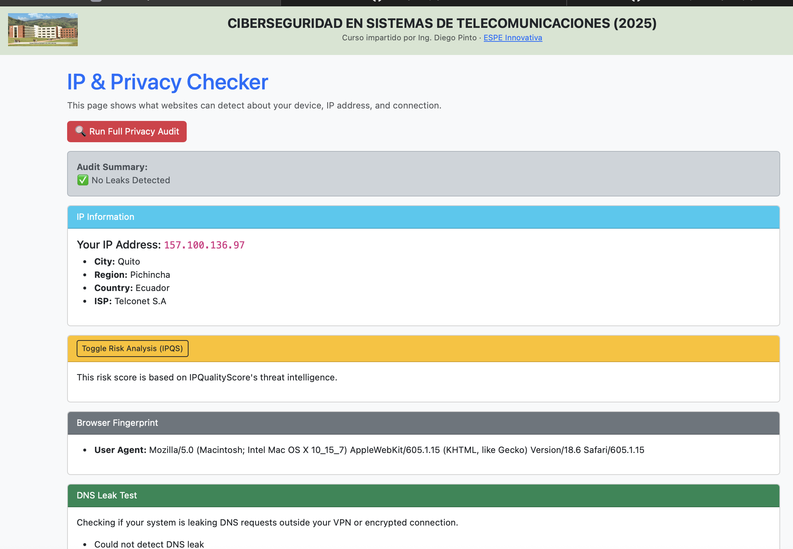

# 🛡️ CyberCheck

**CyberCheck** is a web-based tool for checking your IP, browser fingerprint, DNS leaks, and file hashes/digital signatures.  
Developed for the **Ciberseguridad en Sistemas de Telecomunicaciones (ESPE 2025)** course.

## 🔍 Features

- IP address & location detection  
- Browser fingerprint analysis  
- DNS leak testing  
- File hash and digital signature checker

## 📸 Screenshot

---

## 🚀 Usage

1. Clone the repo  
2. Run the Django app  
3. Open `http://127.0.0.1:8000/ip_checker/` in your browser

## 👨‍🏫 Author

Dr. Jose Lema Alarcon (ESPE)
